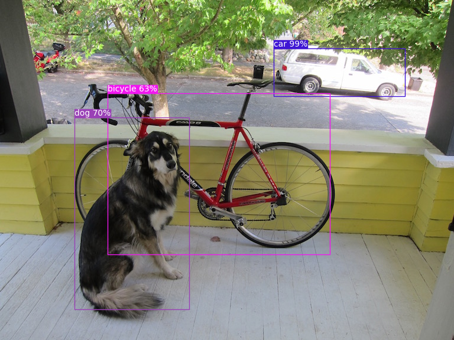
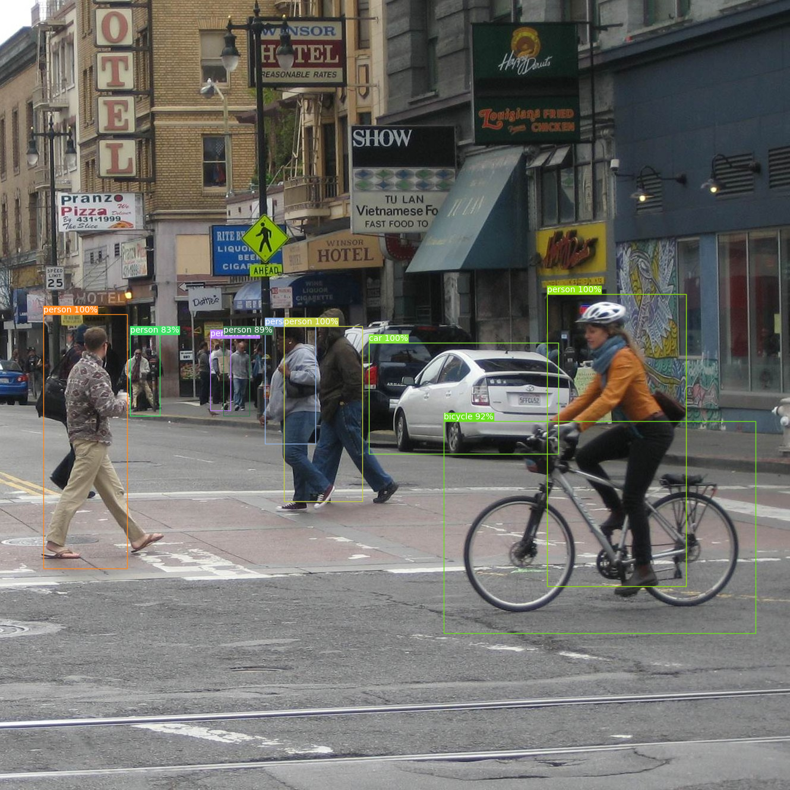

## Introduction

A minimal and modern PyTorch implementation of YOLOv3 that leverages pre-trained weights from [timm](https://github.com/huggingface/pytorch-image-models) and supports training from scratch on the [VOC dataset](https://www.robots.ox.ac.uk/~vgg/projects/pascal/VOC).





See other [examples](data/demo).

## Requirements

- conda 25.9.1+
- python 3.14.3+
- pytorch 2.10.0+
- torchvision 0.25.0+
- timm 1.0.26+
- matplotlib 3.10.8+

## Quick Start

Clone the repo and install dependencies.

```sh
git clone https://github.com/totravel/yolov3.git
cd yolov3/
conda env create -f environment.yaml
conda activate v3
```

Download the pretrained weights from the Release page and place it in the `data/` folder. 

```sh
cd data/
curl -OL https://github.com/totravel/yolov3/releases/latest/download/yolo_best.pth
```

Run the detection script `yolo_detect.py` from the project root directory. Results will be saved to the `out/results` folder by default.

```sh
python yolo_detect.py
```

## Training

Download the VOC 2007 (trainval + test) and 2012 (trainval) datasets and place them in the `data/` folder with the following structure:

```
data
└── VOCdevkit
    ├── VOC2007
    │   ├── Annotations
    │   ├── ImageSets
    │   ├── JPEGImages
    │   └── ...
    └── VOC2012
        ├── Annotations
        ├── ImageSets
        ├── JPEGImages
        └── ...
```

Download the pretrained Darknet53 weights and place it in the `data/` folder. 

```sh
cd data/
curl -OL https://github.com/rwightman/pytorch-image-models/releases/download/v0.1-tpu-weights/darknet53_256_c2ns-3aeff817.pth
```

Run the training script `yolo_train.py` from the project root directory.

```sh
python yolo_train.py
```

## References

- [You Only Look Once: Unified, Real-Time Object Detection](https://arxiv.org/abs/1506.02640)
- [SSD: Single Shot MultiBox Detector](https://arxiv.org/abs/1512.02325)
- [YOLO9000: Better, Faster, Stronger](https://arxiv.org/abs/1612.08242)
- [YOLOv3: An Incremental Improvement](https://arxiv.org/abs/1804.02767)

## License

[MIT](https://github.com/totravel/yolov3/blob/main/LICENSE)
